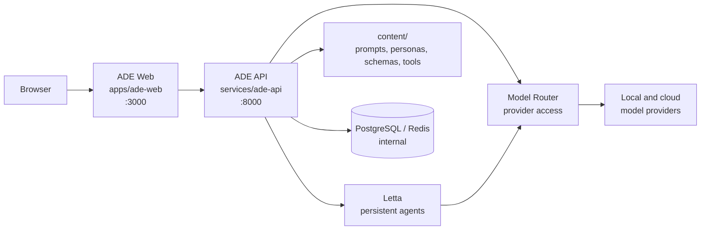
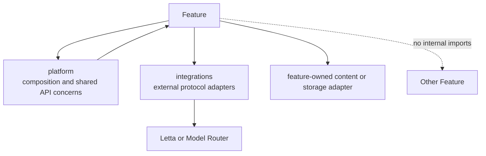

# ADE Target Architecture

> This document describes the accepted target architecture from
> [ADR 0006](../adr/0006-comprehension-first-service-and-feature-architecture.md).
> During migration, consult the current tree and each feature's README for the
> completed slice status.

Letta Open ADE has one simple system story: **ADE Web** presents the product,
**ADE API** owns product workflows, **Model Router** owns model access, and
**Letta** provides persistent agent runtime.



## Repository Shape

```text
apps/
  ade-web/                         # Next.js product UI
    src/app/                       # Thin routes and proxy only
    src/features/                  # Product feature UI, state, API client, tests
    src/shared/                    # UI primitives and HTTP transport

services/
  ade-api/                         # FastAPI product API
    src/ade_api/
      platform/                    # App composition, settings, auth, DI
      integrations/                # Letta and Model Router adapters
      features/                    # Feature-owned API/application/storage/tests
  model-router/                    # OpenAI-compatible provider router

content/                           # Reviewed, human-edited product assets
  prompts/ personas/ label-schemas/ custom-tools/ model-catalog/
workflows/                         # Evals, probes, smoke checks, local artifacts
config/                            # Runtime configuration, especially router sources
infra/                             # Non-application container support assets
docs/                              # Architecture, ADRs, and contributor guides
compose.yaml                       # Primary local operator entrypoint
```

`packages/` is intentionally absent from the default tree. Add one only for a
stable cross-service contract that cannot belong to a service or workflow. The
expected first case is a small `model-catalog-contracts` package for typed probe
and catalog artifacts; a generic `core` package is not allowed.

## Current-To-Target Migration

| Current location | Target location | Migration rule |
| --- | --- | --- |
| `frontend-ade/` | `apps/ade-web/` | Move routes into `src/app/` and product code into `src/features/`. |
| `agent_platform_api/` | `services/ade-api/src/ade_api/` | Rename the package and move behavior into feature folders. |
| `model_router/` | `services/model-router/src/model_router/` | Keep it independent and provider-focused. |
| `prompts/`, `schemas/`, `tools/`, seed/catalog assets | `content/` | Keep reviewed editable assets together, outside service code. |
| `evals/` and workflow-like scripts | `workflows/` | Keep runner, config, inputs, outputs, docs, and tests together. |
| Root `tests/` and layer tests | Owning feature or service | Mirror each feature's behavior near its source; retain service integration tests. |

The migration proceeds in tested vertical slices. A slice moves one complete
feature across UI, API, tests, documentation, and operations, then deletes the
replaced implementation. It does not leave aliases, duplicate source trees, or
two names for the same concern.

## Feature Ownership

Each feature has one discoverable home in both applications:

```text
features/<feature>/
  README.md                        # Purpose, flow, dependencies, storage, tests
  api.py / contracts.py             # ADE API boundary, when applicable
  service.py                        # Feature application behavior, when applicable
  storage.py                        # Feature persistence adapter, when applicable
  ui/ hooks/ client.ts              # ADE Web behavior, when applicable
  tests/                            # Feature unit and API/UI tests
```

The feature set is: `agent-studio`, `comment-lab`, `label-lab`, `prompt-center`,
`schema-center`, `tool-center`, `test-center`, and `model-catalog`.

Feature code may depend on `platform/` contracts and `integrations/`; it must
not import another feature's internal modules. If two features need to interact,
one publishes a narrow application-facing interface or the concern is promoted
to `platform/` only when it is genuinely cross-feature.



## Runtime And Network Boundaries

| Component | Owner | Exposure | Canonical name |
| --- | --- | --- | --- |
| ADE Web | Product interface | Host port `3000` | `ade-web`, `ADE_WEB_*` |
| ADE API | Product workflows | Host port `8000` | `ade-api`, `ADE_API_*` |
| Model Router | Provider access | Compose network only | `model-router`, `MODEL_ROUTER_*` |
| Letta | Agent runtime | Compose network only | `letta`, `LETTA_*` |
| PostgreSQL / Redis | Runtime storage | Compose network only | `postgres`, `redis` |

All browser calls use ADE Web's same-origin proxy. The proxy is the only web
component that receives the server-side ADE API credential. ADE API talks to
Letta and Model Router over the Compose network; browser code never sees those
credentials or provider base URLs.

## Content And Workflow Boundaries

`content/` is versioned product material and contains no application imports.
Prompt Center, Schema Center, and Tool Center own the adapters that validate,
read, edit, and activate their respective content. Runtime projections such as
SQLite state and evaluation outputs remain ignored under `data/` or a workflow's
local `outputs/` directory.

`workflows/` owns executable operational work. A workflow has a runner,
configuration, inputs, outputs, documentation, and tests together. Workflows
use public ADE API or Model Router contracts rather than importing ADE API
feature internals.

## Public Contract Direction

ADE API version 2 is organized by the product capability a caller is using:

```text
/api/v2/agent-studio/...
/api/v2/comment-lab/generations
/api/v2/label-lab/generations
/api/v2/prompt-center/prompts and /personas
/api/v2/schema-center/label-schemas
/api/v2/tool-center/tools and /invocations
/api/v2/test-center/runs
/api/v2/model-catalog/options, /models, and /capabilities
/api/v2/health
```

This is a breaking boundary. `/api/v1`, `agent_platform_api`, `frontend-ade`,
`AGENT_PLATFORM_*`, `ADE_FRONTEND_*`, and old OpenAPI artifact names are removed
when their replacement is live. Ports, database data, prompt/persona/schema/tool
keys, and Model Router's OpenAI-compatible `/v1` API are retained unless a later
ADR explicitly changes them.
