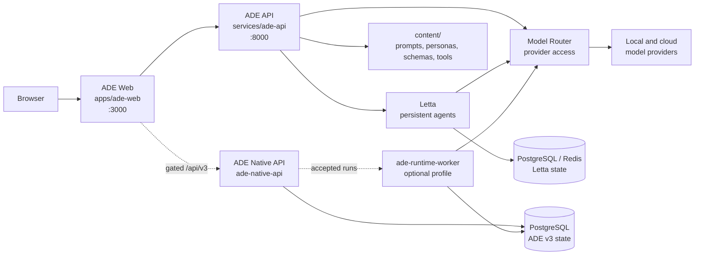
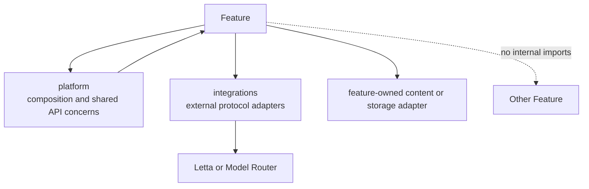

# ADE Architecture

This document describes the implemented architecture defined by
[ADR 0006](../adr/0006-comprehension-first-service-and-feature-architecture.md).
The repository tree and each feature's README are the current source for local
ownership and operational details.

Letta Open ADE has one simple system story: **ADE Web** presents the product,
**ADE API** owns product workflows, **Model Router** owns model access, and
**Letta** provides the supported persistent Agent Studio runtime. An accepted,
disabled-by-default native v3 preview uses an isolated API and separate worker to
exercise ADE-owned persistence without changing that product path.



## Repository Shape

```text
apps/
  ade-web/                         # Next.js product UI
    src/app/                       # Thin routes and proxy only
    src/features/                  # Product feature UI, state, API client, tests
    src/shared/                    # UI primitives and HTTP transport

services/
  ade-api/                         # FastAPI product API
    migrations/                    # Alembic authority for ADE-owned PostgreSQL
    src/ade_api/
      platform/                    # App composition, settings, auth, DI
      integrations/                # Letta and Model Router adapters
      features/                    # Feature-owned API/application/storage/tests
  model-router/                    # OpenAI-compatible provider router

content/                           # Reviewed, human-edited product assets
  prompts/ personas/ label-schemas/ custom-tools/ model-catalog/
workflows/                         # Evals, probes, smoke checks, local artifacts
config/                            # Runtime configuration, especially router sources
infra/                             # Non-application container support assets
docs/                              # Architecture, ADRs, and contributor guides
compose.yaml                       # Primary local operator entrypoint
```

`packages/model-catalog-contracts/` contains the small, stable catalog and probe
contracts shared across services. `packages/agent-runtime-eval-contracts/` contains
only runtime-neutral fixtures, observations, scoring, and qualification contracts
shared by the two agent-runtime evals. A generic `core` package is not allowed.

## Architecture Invariants

- Every product capability has one feature home in ADE Web and ADE API.
- A vertical change keeps its UI, API, tests, documentation, and operations in
  the owning feature or workflow, then removes replaced code.
- A current concern has one name and one home. Compatibility aliases and
  duplicate implementations are not retained.
- `content/` holds reviewed product material; `data/runtime/` and workflow
  `outputs/` hold generated local state.

## Feature Ownership

Each feature has one discoverable home in both applications:

```text
features/<feature>/
  README.md                        # Purpose, flow, dependencies, storage, tests
  api.py / contracts.py             # ADE API boundary, when applicable
  service.py                        # Feature application behavior, when applicable
  storage.py                        # Feature persistence adapter, when applicable
  ui/ hooks/ client.ts              # ADE Web behavior, when applicable
  tests/                            # Feature unit and API/UI tests
```

The feature set is: `agent-studio`, `comment-lab`, `label-lab`, `prompt-center`,
`schema-center`, `tool-center`, `test-center`, and `model-catalog`. The separately
gated `native-runtime-preview` feature is an evaluation-backed pilot, not a mode of
Agent Studio or part of the supported v2 product contract.

Feature code may depend on `platform/` contracts and `integrations/`; it must
not import another feature's internal modules. If two features need to interact,
one publishes a narrow application-facing interface or the concern is promoted
to `platform/` only when it is genuinely cross-feature.



## Runtime And Network Boundaries

| Component | Owner | Exposure | Canonical name |
| --- | --- | --- | --- |
| ADE Web | Product interface | Host port `3000` | `ade-web`, `ADE_WEB_*` |
| ADE API | Product workflows | Host port `8000` | `ade-api`, `ADE_API_*` |
| Model Router | Provider access | Compose network only | `model-router`, `MODEL_ROUTER_*` |
| Letta | Agent runtime | Compose network only | `letta`, `LETTA_*` |
| Native runtime worker | Opt-in v3 run execution | Compose profile only | `ade-runtime-worker`, `ADE_API_AGENT_RUNTIME_V3_*` |
| ADE Native API | Isolated v3 preview surface | Loopback `8002`, Compose profile only | `ade-native-api`, `ADE_NATIVE_API_*` |
| PostgreSQL | Letta and separate ADE v3 databases | Compose network only | `postgres`, `LETTA_PG_*`, `ADE_PG_*` |
| Redis | Current Letta runtime storage | Compose network only | `redis`, `LETTA_REDIS_*` |

All browser calls use ADE Web's same-origin proxy. The proxy is the only web
component that receives the server-side ADE API credential. ADE API talks to
Letta and Model Router over the Compose network; browser code never sees those
credentials or provider base URLs.

## Content And Workflow Boundaries

`content/` is versioned product material and contains no application imports.
Prompt Center, Schema Center, and Tool Center own the adapters that validate,
read, edit, and activate their respective content. Runtime projections such as
SQLite state and evaluation outputs remain ignored under `data/` or a workflow's
local `outputs/` directory.

`workflows/` owns executable operational work. A workflow has a runner,
configuration, inputs, outputs, documentation, and tests together. Workflows
use public ADE API or Model Router contracts rather than importing ADE API
feature internals.

## Public Contract Direction

ADE API version 2 is organized by the product capability a caller is using:

```text
/api/v2/agent-studio/...
/api/v2/comment-lab/generations
/api/v2/label-lab/generations
/api/v2/prompt-center/prompts and /personas
/api/v2/schema-center/label-schemas
/api/v2/tool-center/tools and /invocations
/api/v2/test-center/runs
/api/v2/model-catalog/options, /models, and /capabilities
/api/v2/health
```

ADE API version 2 is the supported ADE product contract. Prompt, persona,
schema, tool, and model-selection keys remain stable across this structure.
Model Router retains its OpenAI-compatible `/v1` API.

The opt-in native preview exposes a breaking `/api/v3` resource model for agent
definitions, atomic preview sessions, memory subjects, conversations, turns,
runs/events, and typed memories. Its separate ADE Web page and navigation remain
build-gated until exact deployment promotion; it has no compatibility promise and
is never an Agent Studio mode. See
[ADR 0013](../adr/0013-narrow-native-runtime-product-pilot.md). Any future
public-contract change requires an ADR and regenerated OpenAPI artifacts.
