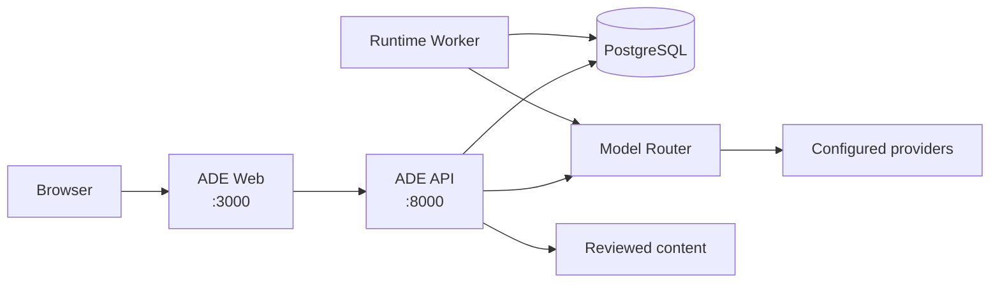

# ADE Architecture

ADE has one current product path: ADE Web sends same-origin requests to one ADE
API. That API serves the labs and content centers under `/api/v2` and the native
Agent Studio runtime under `/api/v3`.



## Service Boundaries

| Component | Responsibility | Exposure |
| --- | --- | --- |
| ADE Web | Browser UI and same-origin API proxy | Host port `3000` |
| ADE API | Product APIs, content centers, Test Center, and Agent Studio reads | Host port `8000` |
| Runtime worker | Claims and executes Agent Studio runs | Compose network |
| Migration job | Applies Alembic migrations before the API starts | Compose network |
| PostgreSQL | Persistent Agent Studio and product runtime state | Compose network |
| Model Router | Provider discovery, canonical model identity, profiles, and forwarding | Compose network |

PostgreSQL is the Agent Studio state authority. Model Router is the provider and
model identity authority. The API and worker own timeout, retry, cancellation,
and event policy; provider clients do not add hidden retries.

## Repository Shape

```text
apps/ade-web/                         # Browser product
services/ade-api/                     # Product API and native Agent Studio runtime
services/model-router/                # Provider boundary
content/                              # Prompts, personas, schemas, model reports
config/model-router/                  # Sources and profiles
workflows/                            # Evals, qualification, probes, smoke checks
docs/                                 # Current architecture and historical decisions
```

A feature owns its UI, API contract, application behavior, tests, and local
README. `platform/` composes shared application concerns; `integrations/` only
adapts external protocols. Features do not import each other's internals.

## Product Boundaries

- Agent Studio uses `/api/v3` for reusable definitions, explicit memory
  subjects, immutable messages, typed memory, runs, events, and cancellation.
- Comment Lab and Label Lab use `/api/v2` and Model Router for generation.
- Prompt Center and Schema Center own reviewed content under `content/`.
- Model Catalog turns Model Router data into feature-ready options.
- Test Center launches behavior evaluation, agent runtime qualification, and
  current-stack smoke workflows only.

Agent Studio exposes curated product tools such as memory search. Deterministic
weather and failure tools exist only inside evaluation sessions. Arbitrary tool
authoring is intentionally out of scope until a product execution and sandbox
contract exists.

## Release And Recovery

The release ledger binds the reviewed source identity, API/worker build identity,
policy hashes, active model aliases, agent bundle, qualification, deterministic
conformance, and reviewer approval. See [ADR 0019](../adr/0019-ade-steady-state-runtime.md).

Recovery is deployment rollback plus PostgreSQL backup/restore. Historical data
from removed runtimes is left dormant and is not imported into ADE state.
