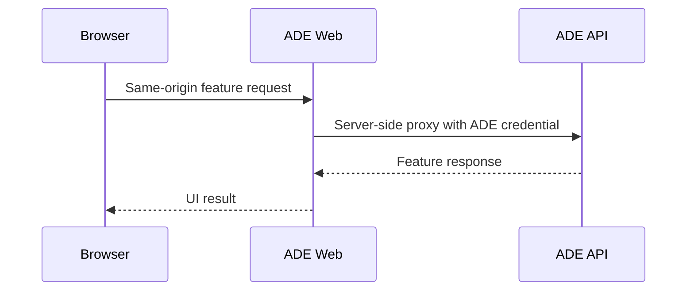
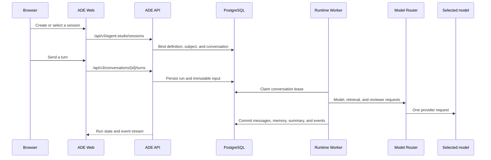
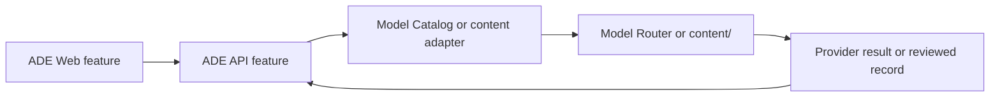

# ADE Request Flows

## Shared Web Path

ADE Web is the only browser-facing component. It proxies both `/api/v2` and
`/api/v3` to the single ADE API and keeps the API credential server-side.

## Agent Studio

An agent definition is a reusable behavior snapshot. A memory subject owns
durable facts. A conversation binds one definition to one subject and retains
immutable messages. The runtime validates typed memory proposals against the
bound subject and sources them to messages; model arguments cannot select another
subject.

## Labs And Content Centers

Comment Lab and Label Lab resolve a canonical model key through Model Catalog,
then send one router-backed request. Prompt Center and Schema Center validate
and manage reviewed content; neither invokes a provider.

## Test Center

Test Center launches only three named workflows:

1. Behavior evaluation: chat-memory evidence and deterministic scoring.
2. Agent runtime qualification: release-eligible native runtime evidence.
3. Current-stack smoke: service-level operational checks.

The orchestrator writes run manifests and artifacts inside the allocated run
directory. Artifact access is rooted to that directory and exposed through a
`TestRunDescriptor`; raw artifacts remain diagnostics rather than an alternate
product contract.
