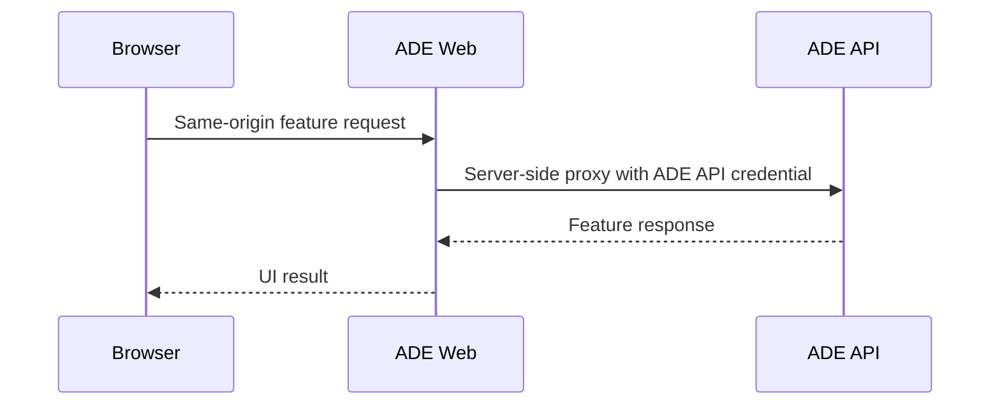
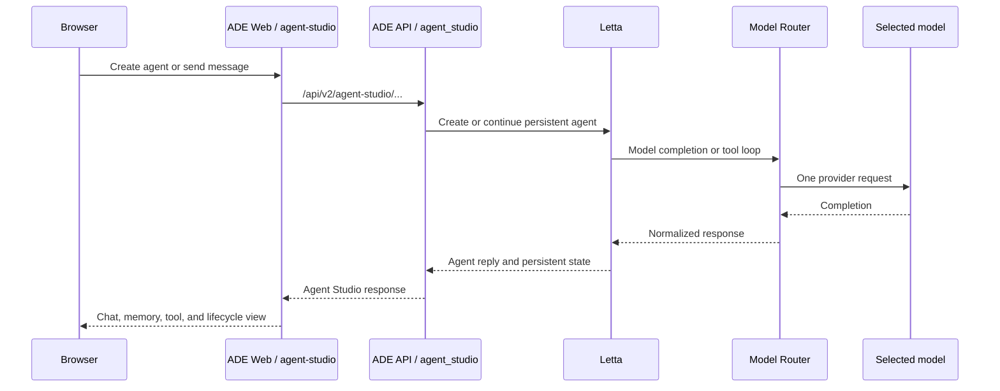
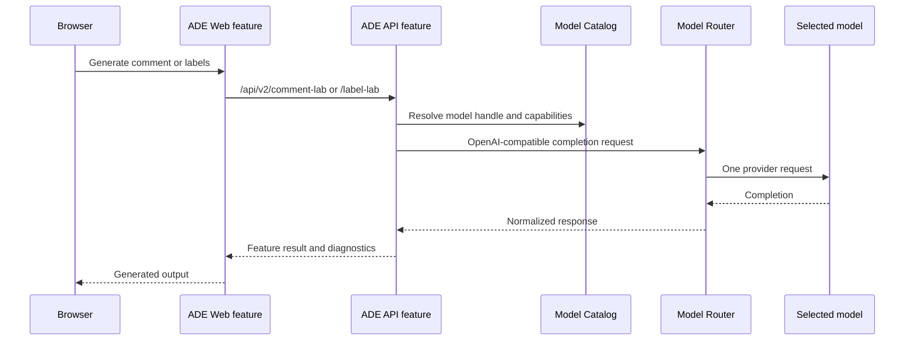
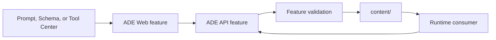
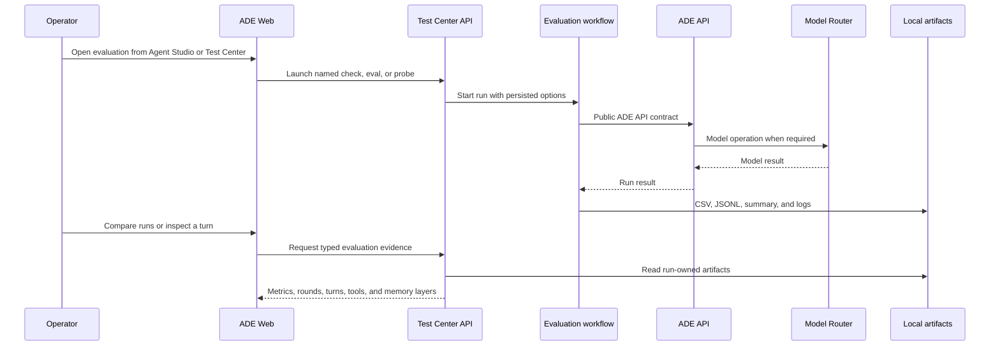
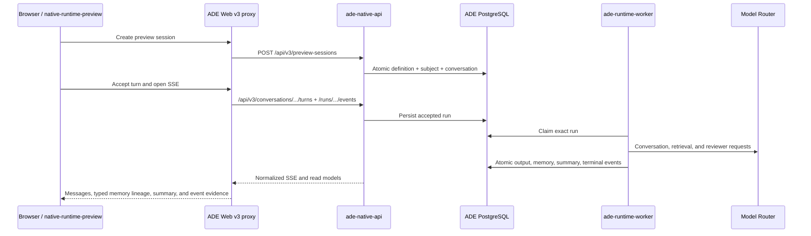

# ADE Request Flows

These flows describe the implemented architecture defined by
[ADR 0006](../adr/0006-comprehension-first-service-and-feature-architecture.md).
Use the owning feature README for feature-specific contracts and operational
notes.

## Shared Web Request Path

The browser knows the ADE Web origin only. ADE Web owns user-facing routing and
the server-side API credential. API contracts and feature behavior belong to
ADE API.

## Agent Studio

`agent_studio` is the sole ADE feature that owns agent lifecycle, persistent
state, and Letta orchestration. It requests a resolved model capability from the
Model Router integration; it does not inspect provider files or call providers.

## Comment Lab And Label Lab

Both features own their prompts, request mapping, response mapping, timeout,
and retry policy. Model Router owns upstream provider behavior. Retry ownership
must remain singular: a user-requested feature retry never combines with a
hidden router retry.

## Content Centers

Prompt Center owns prompt and persona editing, Schema Center owns label-schema
editing, and Tool Center owns custom-tool editing and invocation. Each uses a
feature-specific adapter to validate and operate on `content/`; no generic
registry is allowed to hide the owner.

## Test Center And Workflows

Test Center owns interactive run launch, persisted launch options, and typed
read models projected from run-owned artifacts. Agent Studio may prefill a Test
Center evaluation but does not execute it or mutate the selected agent. Raw
artifacts remain secondary diagnostics. `workflows/` owns CLI-oriented evals,
probes, and smoke checks. Both consume public boundaries; neither imports
arbitrary ADE API internals. Provider probes that must call providers run within
Model Router's service boundary. See
[ADR 0008](../adr/0008-test-center-evaluation-read-models.md) for this ownership
contract.

Native-runtime qualification is a stricter form of this flow: the workflow calls
the authenticated worker-health endpoint first, then calls the real `/api/v3`
asynchronous API and worker only after preflight passes, captures normalized events and
PostgreSQL-backed memory evidence, and then purges only its run-owned resources.
Only complete production-path rounds may emit a promotion proposal, and applying
that proposal is a separate reviewed operator action under
[ADR 0010](../adr/0010-production-path-runtime-qualification.md). Request-level
provider failures and process-readiness evidence follow
[ADR 0011](../adr/0011-agent-runtime-operational-readiness.md).

## Gated Native Runtime Pilot

The v3 proxy points only to `ade-native-api`; it never falls back to the supported
v2 service. The browser cannot assemble a partial session with three writes. The
server binds a request idempotency key to one atomic resource set and fixes the
pilot's tool scope to `search_memory`. Navigation remains off until the exact role
deployments pass the reviewed gate in
[ADR 0013](../adr/0013-narrow-native-runtime-product-pilot.md).

## Model Catalog

The Model Catalog feature is the one ADE-facing interpretation boundary for
model availability and capabilities. It reads Model Router's normalized catalog
and returns selection-ready options to other ADE features. No lab, agent, or UI
feature parses source files, model profiles, provider endpoints, or probe report
formats directly.
