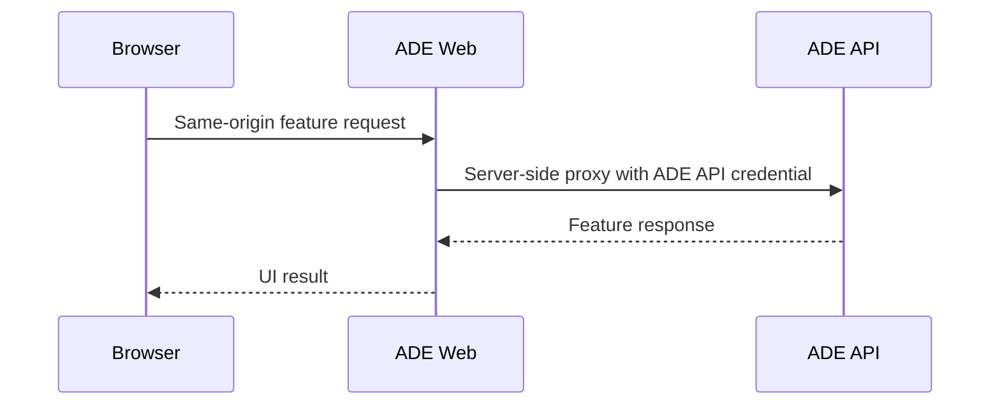
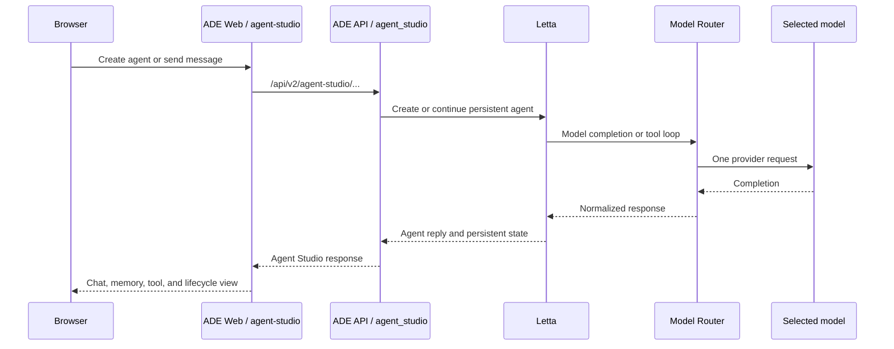
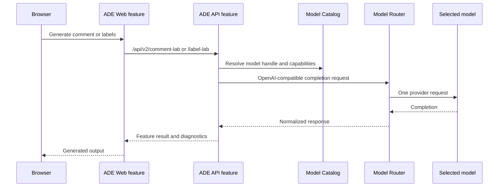
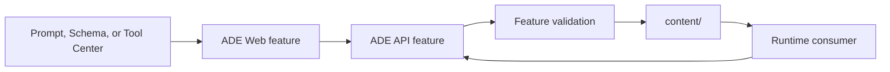
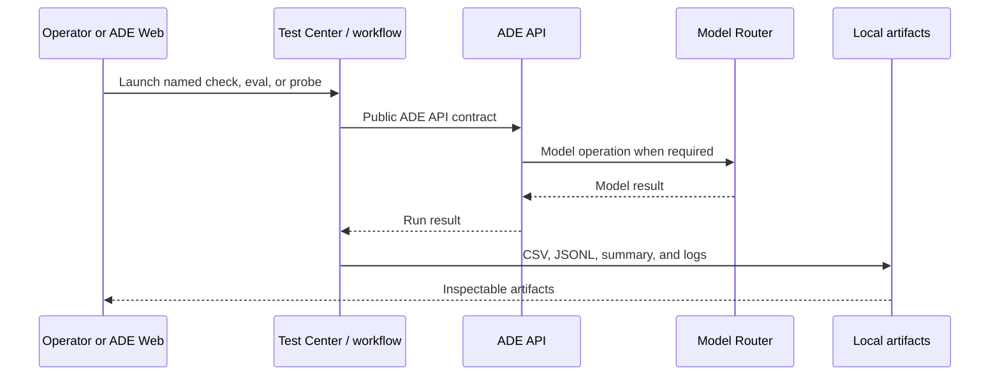

# ADE Request Flows

These flows describe the implemented architecture defined by
[ADR 0006](../adr/0006-comprehension-first-service-and-feature-architecture.md).
Use the owning feature README for feature-specific contracts and operational
notes.

## Shared Web Request Path

The browser knows the ADE Web origin only. ADE Web owns user-facing routing and
the server-side API credential. API contracts and feature behavior belong to
ADE API.

## Agent Studio

`agent_studio` is the sole ADE feature that owns agent lifecycle, persistent
state, and Letta orchestration. It requests a resolved model capability from the
Model Router integration; it does not inspect provider files or call providers.

## Comment Lab And Label Lab

Both features own their prompts, request mapping, response mapping, timeout,
and retry policy. Model Router owns upstream provider behavior. Retry ownership
must remain singular: a user-requested feature retry never combines with a
hidden router retry.

## Content Centers

Prompt Center owns prompt and persona editing, Schema Center owns label-schema
editing, and Tool Center owns custom-tool editing and invocation. Each uses a
feature-specific adapter to validate and operate on `content/`; no generic
registry is allowed to hide the owner.

## Test Center And Workflows

Test Center owns interactive run launch and artifact viewing. `workflows/` owns
CLI-oriented evals, probes, and smoke checks. Both consume public boundaries;
neither imports arbitrary ADE API internals. Provider probes that must call
providers run within Model Router's service boundary.

## Model Catalog

The Model Catalog feature is the one ADE-facing interpretation boundary for
model availability and capabilities. It reads Model Router's normalized catalog
and returns selection-ready options to other ADE features. No lab, agent, or UI
feature parses source files, model profiles, provider endpoints, or probe report
formats directly.
