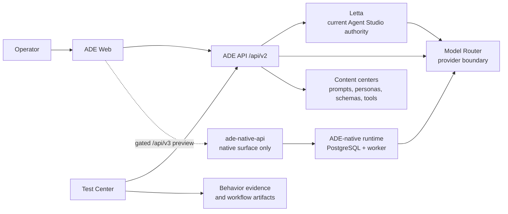

# ADE System Status Map

Use this page to explain ADE's present authority and direction in a few
minutes. It is a status map, not a replacement for the ADRs that define durable
runtime decisions.

## One-Sentence Model

ADE is a local-first operator workspace for improving agent behavior with evidence:
ADE Web presents the workflow, ADE API owns product orchestration, Model Router owns
provider access, and Letta currently owns the supported Agent Studio runtime while
the native v3 cutover gate remains incomplete.

## Current Authority

| Concern | Current authority | Status |
| --- | --- | --- |
| Product UI and browser contract | ADE Web and `/api/v2` | Supported product path |
| Persistent Agent Studio execution and current agent state | Letta `0.16.8` | Supported product path |
| Provider discovery, capability policy, and generation routing | Model Router | Supported shared boundary |
| Prompts, personas, schemas, and custom-tool content | `content/` through its owning center | Reviewed product material |
| Product behavior evidence | Test Center and feature-owned evaluation workflows | Delivered evaluation-loop baseline |
| ADE-native agent runtime | isolated `ade-native-api`, ADE PostgreSQL, and `ade-runtime-worker` | Phase 4/5 implementation in progress; not yet the supported Agent Studio authority |

The native runtime remains deliberately separate while the cutover gate is pending.
It neither imports Letta agents nor dual-writes state.
[ADR 0016](../adr/0016-ade-native-agent-studio-cutover.md) authorizes implementation
of a fresh-start cutover contract, but does not claim that candidate-qualification
evidence has passed. Effective cutover needs current qualification and three clean
Test Center-owned schema-v2 paired DGX rounds in which native passes and does not
trail the observed Letta baseline. Until then, current Agent Studio, `/api/v2`, and
Letta remain the supported product path.

## Product Spine

The core operator outcome is the **Agent Behavior Evaluation Loop**:

1. Build or configure an agent experience.
2. Select the relevant model, prompt, persona, embedding, and fixture.
3. Evaluate the behavior and inspect reply, tool, and memory evidence.
4. Refine the content that explains the outcome.
5. Compare with a baseline and decide to keep, promote, or reject the change.

Agent Studio, Prompt Center, Model Catalog, and Test Center serve this loop.
Comment Lab and Label Lab should receive their own evaluation flows only when a
task-specific contract makes the result meaningful. Stack health, provider
probes, diagnostics, and native-runtime qualification remain Operations work:
they support confidence in the loop but do not measure product behavior.

## Direction And Gates

| Horizon | Outcome | Decision gate |
| --- | --- | --- |
| Delivered | Evaluation is the primary product journey, with deterministic evidence, verified content-addressed inputs, readable comparisons, and explicit keep/promote/reject decisions. | Product-quality evaluation remains distinct from stack health, diagnostics, and runtime qualification. |
| Now | Complete Phase 4 v2/v3 paired-baseline candidate evidence and Phase 5 cutover implementation. | Current qualification plus three clean Test Center-owned schema-v2 DGX rounds with native `3/3` and non-regression are reviewed. Qualification alone is insufficient. |
| Next | Activate the fresh-start v3 Agent Studio only after the Phase 4 gate. | The exact qualified DGX bundle is the only initial product bundle; reset and release-level rollback contracts are ready and verified. |
| Later | Remove legacy runtime dependencies in Phase 6. | No product traffic or deployment dependency remains on Letta, Redis, v2 Agent Studio endpoints, or retained legacy evidence. |

## Read Next

- [Product Roadmap](../product-roadmap.md) for outcome priorities and the full
  milestone wording.
- [Architecture Overview](overview.md) for service boundaries and repository
  structure.
- [Codebase Map](../codebase-map.md) to locate the owner of a change.
- [ADR 0009](../adr/0009-ade-owned-agent-runtime.md),
  [ADR 0010](../adr/0010-production-path-runtime-qualification.md),
  [ADR 0011](../adr/0011-agent-runtime-operational-readiness.md),
  [ADR 0013](../adr/0013-narrow-native-runtime-product-pilot.md),
  [ADR 0016](../adr/0016-ade-native-agent-studio-cutover.md), and
  [ADR 0017](../adr/0017-incumbent-baseline-does-not-veto-native-cutover.md) before
  changing or describing the native runtime.
