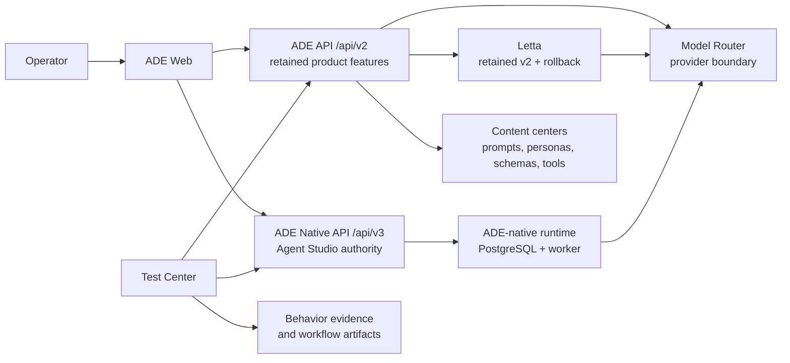

# ADE System Status Map

Use this page to explain ADE's present authority and direction in a few
minutes. It is a status map, not a replacement for the ADRs that define durable
runtime decisions.

## One-Sentence Model

ADE is a local-first operator workspace for improving agent behavior with evidence:
ADE Web presents the workflow, ADE API owns product orchestration, ADE Native API and
its worker own Agent Studio, and Model Router owns provider access. Letta remains only
for retained v2 capabilities and the release-level Agent Studio rollback lane.

## Current Authority

| Concern | Current authority | Status |
| --- | --- | --- |
| Product UI and browser contracts | ADE Web, `/api/v3` for Agent Studio, and `/api/v2` for retained features | Supported product paths |
| Persistent Agent Studio execution and current agent state | `ade-native-api`, ADE PostgreSQL, and `ade-runtime-worker` | Supported Agent Studio authority |
| Provider discovery, capability policy, and generation routing | Model Router | Supported shared boundary |
| Prompts, personas, schemas, and custom-tool content | `content/` through its owning center | Reviewed product material |
| Product behavior evidence | Test Center and feature-owned evaluation workflows | Delivered evaluation-loop baseline |
| Letta `0.16.8` and Redis | Retained v2 ADE API capabilities | Not Agent Studio authority; retained for release-level rollback until Phase 6 |

Milestone 4 qualification and Milestone 5 fresh-start cutover are complete. The
reviewed [release ledger](../../config/agent-studio/release-evidence.json) records
three passing native qualification rounds, three clean Test Center-owned schema-v2
paired DGX rounds with native `3/3` and per-round non-regression, deterministic
conformance, llama-server compatibility, completed cleanup, and a successful
release-level rollback rehearsal. Agent Studio now uses `/api/v3` exclusively; it
does not import Letta agents, dual-write state, expose a runtime toggle, or fall back
to Letta per request. Phase 5 retains the prior v2 lane only for deliberate release
rollback while Phase 6 remains a separate decision.

## Product Spine

The core operator outcome is the **Agent Behavior Evaluation Loop**:

1. Build or configure an agent experience.
2. Select the relevant model, prompt, persona, embedding, and fixture.
3. Evaluate the behavior and inspect reply, tool, and memory evidence.
4. Refine the content that explains the outcome.
5. Compare with a baseline and decide to keep, promote, or reject the change.

Agent Studio, Prompt Center, Model Catalog, and Test Center serve this loop.
Comment Lab and Label Lab should receive their own evaluation flows only when a
task-specific contract makes the result meaningful. Stack health, provider
probes, diagnostics, and native-runtime qualification remain Operations work:
they support confidence in the loop but do not measure product behavior.

## Direction And Gates

| Horizon | Outcome | Decision gate |
| --- | --- | --- |
| Delivered | Evaluation is the primary product journey, and Milestones 4 and 5 qualified and activated the fresh-start native Agent Studio. | The reviewed release ledger binds qualification, paired evidence, deterministic conformance, cleanup, and rollback rehearsal to the approved deployment. |
| Now | Operate and stabilize the native Agent Studio product path while preserving the explicit v2 rollback boundary. | Every release passes the evidence gate; policy or deployment identity changes trigger requalification; production behavior remains observable and recoverable. |
| Next | Decide whether Phase 6 can remove Letta, Redis, and the rollback-only v2 Agent Studio path. | No product traffic or required deployment capability depends on the legacy runtime, and an explicit removal decision replaces the rollback plan. |
| Later | Rename the project after Letta is absent from code, runtime, documentation, and operator vocabulary. | The rename is coordinated separately and does not hide unfinished dependency removal. |

## Read Next

- [Product Roadmap](../product-roadmap.md) for outcome priorities and the full
  milestone wording.
- [Architecture Overview](overview.md) for service boundaries and repository
  structure.
- [Codebase Map](../codebase-map.md) to locate the owner of a change.
- [ADR 0009](../adr/0009-ade-owned-agent-runtime.md),
  [ADR 0010](../adr/0010-production-path-runtime-qualification.md),
  [ADR 0011](../adr/0011-agent-runtime-operational-readiness.md),
  [ADR 0013](../adr/0013-narrow-native-runtime-product-pilot.md),
  [ADR 0016](../adr/0016-ade-native-agent-studio-cutover.md), and
  [ADR 0017](../adr/0017-incumbent-baseline-does-not-veto-native-cutover.md) before
  changing or describing the native runtime.
