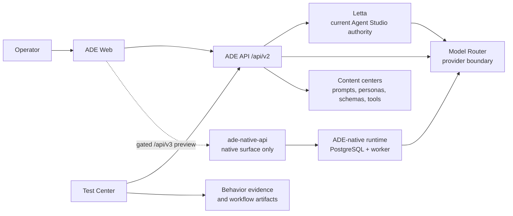

# ADE System Status Map

Use this page to explain ADE's present authority and direction in a few
minutes. It is a status map, not a replacement for the ADRs that define durable
runtime decisions.

## One-Sentence Model

ADE is a local-first operator workspace for improving agent behavior with
evidence: ADE Web presents the workflow, ADE API owns product orchestration,
Model Router owns provider access, and Letta currently owns the supported
Agent Studio runtime.

## Current Authority

| Concern | Current authority | Status |
| --- | --- | --- |
| Product UI and browser contract | ADE Web and `/api/v2` | Supported product path |
| Persistent Agent Studio execution and current agent state | Letta `0.16.8` | Supported product path |
| Provider discovery, capability policy, and generation routing | Model Router | Supported shared boundary |
| Prompts, personas, schemas, and custom-tool content | `content/` through its owning center | Reviewed product material |
| Product behavior evidence | Test Center and feature-owned evaluation workflows | Delivered evaluation-loop baseline |
| ADE-native agent runtime | isolated `ade-native-api`, ADE PostgreSQL, and `ade-runtime-worker` | Qualified candidate with a separate release-gated pilot; disabled in the ordinary stack |

The native candidate is deliberately separate. It neither imports Letta agents
nor dual-writes state. Its `/native-runtime-preview` product slice is build-gated,
uses a dedicated native proxy, and never appears as an Agent Studio mode. The
checked-in role deployments passed the ADR 0010 qualification and reviewed-promotion
gate on 2026-09-02; the gate still revalidates their exact identities and current
policy hashes before every release-preview start. Do not describe the pilot as a
replacement or supported Agent Studio runtime unless a later cutover ADR is accepted.

## Product Spine

The core operator outcome is the **Agent Behavior Evaluation Loop**:

1. Build or configure an agent experience.
2. Select the relevant model, prompt, persona, embedding, and fixture.
3. Evaluate the behavior and inspect reply, tool, and memory evidence.
4. Refine the content that explains the outcome.
5. Compare with a baseline and decide to keep, promote, or reject the change.

Agent Studio, Prompt Center, Model Catalog, and Test Center serve this loop.
Comment Lab and Label Lab should receive their own evaluation flows only when a
task-specific contract makes the result meaningful. Stack health, provider
probes, diagnostics, and native-runtime qualification remain Operations work:
they support confidence in the loop but do not measure product behavior.

## Direction And Gates

| Horizon | Outcome | Decision gate |
| --- | --- | --- |
| Delivered | Evaluation is the primary product journey, with deterministic evidence, verified content-addressed inputs, readable comparisons, and explicit keep/promote/reject decisions. | Product-quality evaluation remains distinct from stack health, diagnostics, and runtime qualification. |
| Now | Operate the qualified native runtime as a narrow, separate pilot and collect product and operational evidence. | Representative pilot use demonstrates whether typed memory, immutable history, curated tools, recovery, and operator evidence improve the intended workflow enough to justify a cutover proposal. |
| Next | Decide whether to iterate, reject, or propose a fresh-start v3 cutover. | A new ADR records the product evidence, operating boundary, reset/rollback plan, and removal sequence; qualification is rerun whenever a bound deployment or policy identity changes. |
| Later | A fresh-start v3 cutover removes the dual-runtime system. | A later cutover ADR is accepted after product-pilot evidence; only then can new Agent Studio traffic move and Letta/Redis removal begin. |

## Read Next

- [Product Roadmap](../product-roadmap.md) for outcome priorities and the full
  milestone wording.
- [Architecture Overview](overview.md) for service boundaries and repository
  structure.
- [Codebase Map](../codebase-map.md) to locate the owner of a change.
- [ADR 0009](../adr/0009-ade-owned-agent-runtime.md),
  [ADR 0010](../adr/0010-production-path-runtime-qualification.md), and
  [ADR 0011](../adr/0011-agent-runtime-operational-readiness.md), and
  [ADR 0013](../adr/0013-narrow-native-runtime-product-pilot.md) before
  changing or describing the native runtime.
