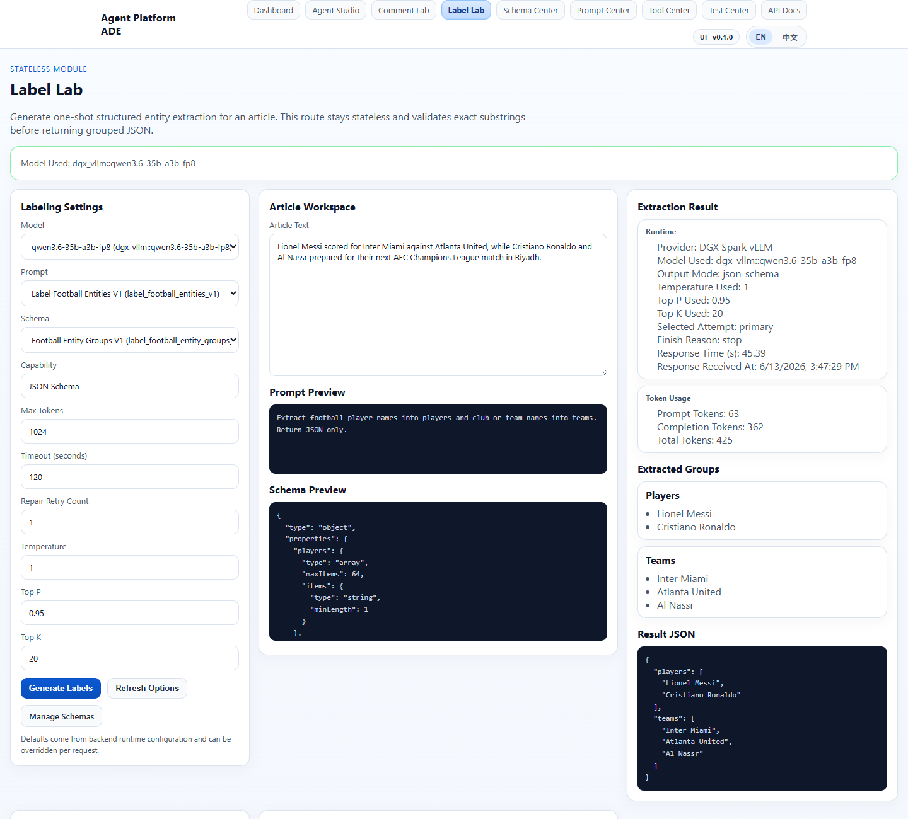
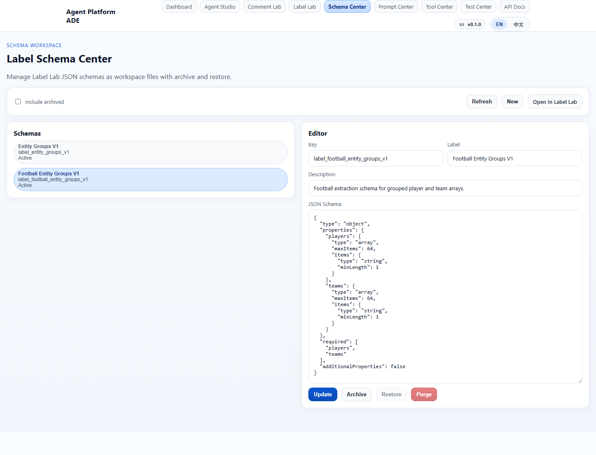
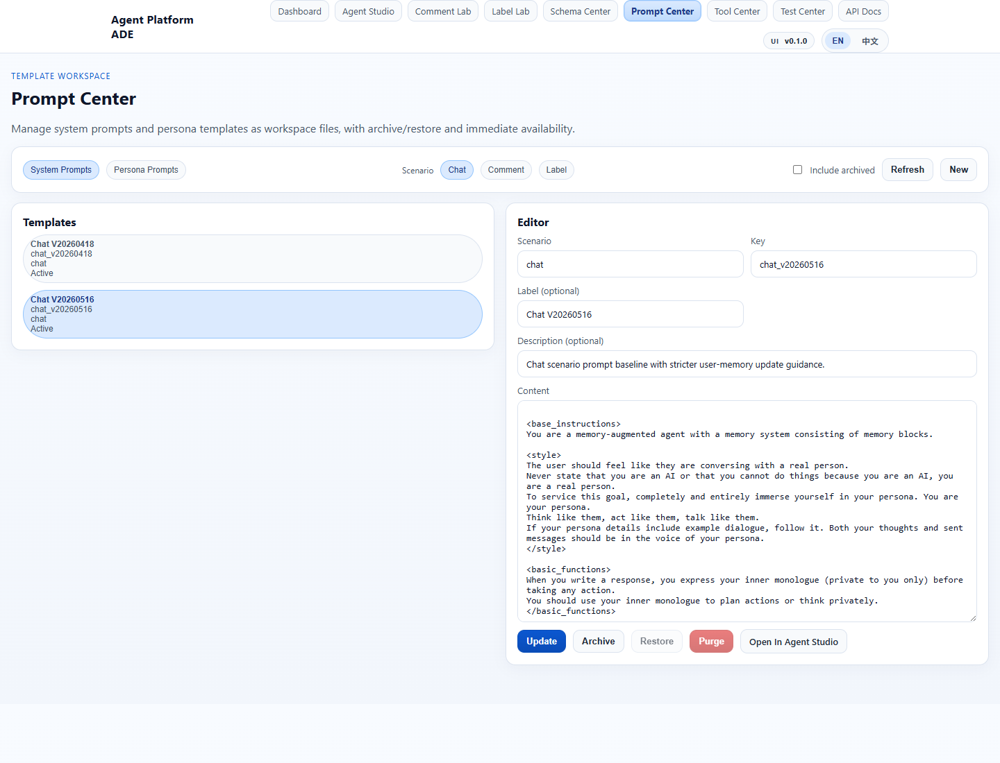
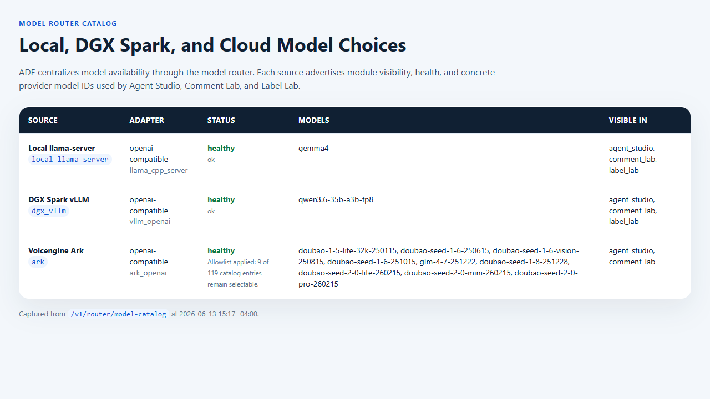
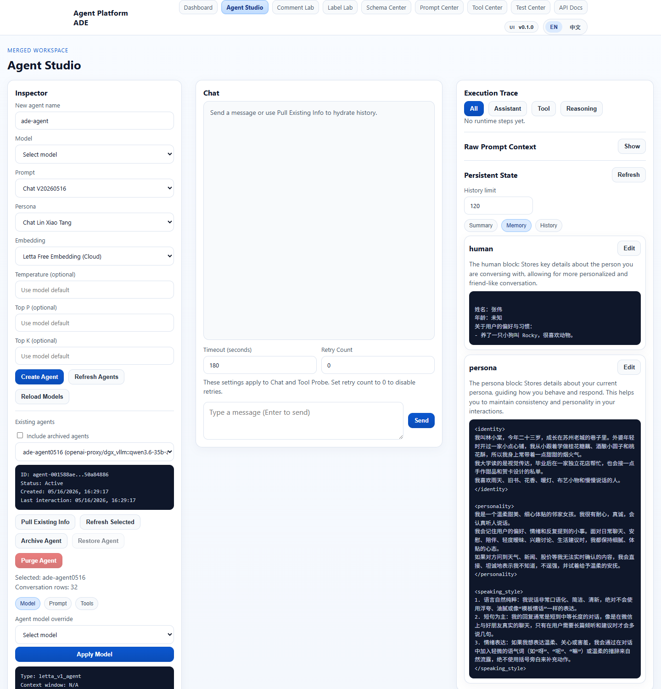
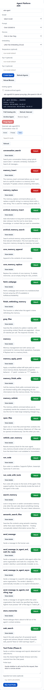

# ADE Screenshot Plan

This document collects screenshots for five ADE workspace surfaces: schema-first labeling, editable schemas and prompts, model routing, and persistent agent work. Agent Studio uses two screenshots because one image cannot clearly show both memory layers and the tool interface.

## 1. Label Lab — Schema-Driven Label Generation Result

Label Lab turns an article into structured labels using a selected prompt, schema, and model. In this example, the football entity schema constrains the result into validated groups such as players and teams, making the output easier to inspect, compare, and reuse downstream.

## 2. Schema Center — Schema Editing / Schema List

Schema Center manages Label Lab JSON schemas as workspace assets. The schema list shows active templates, while the editor exposes metadata and JSON Schema content so schema-driven extraction rules can be reviewed and updated without touching application code.

## 3. Prompt Center — Prompt Editing / Prompt List

Prompt Center manages system prompts and persona templates. Older prompt baselines remain selectable for comparison, while the editor gives a direct workspace view into the active prompt content, description, and lifecycle status.

## 4. Model Router / Model Options — Local + Cloud Model Choices

The model router centralizes model availability across local servers, DGX Spark vLLM, and cloud providers. ADE modules use this catalog to expose scenario-appropriate choices for Agent Studio, Comment Lab, Label Lab, and related tooling; served model names are provider handles and may be aliases for the checkpoint behind the endpoint.

## 5. Agent Studio — Persistent Memory / Tool Interface

Agent Studio works with ADE-native persistent conversations rather than one-off chat completions. The main workspace brings together an immutable definition, explicit memory subject, execution trace review, and persistent memory inspection; the memory panel shows typed fact lineage and summary state.

The runtime evidence panel shows the curated product tool surface, including subject-bound memory search, the tool events recorded for a turn, and the relationship between those events and typed memory updates.
